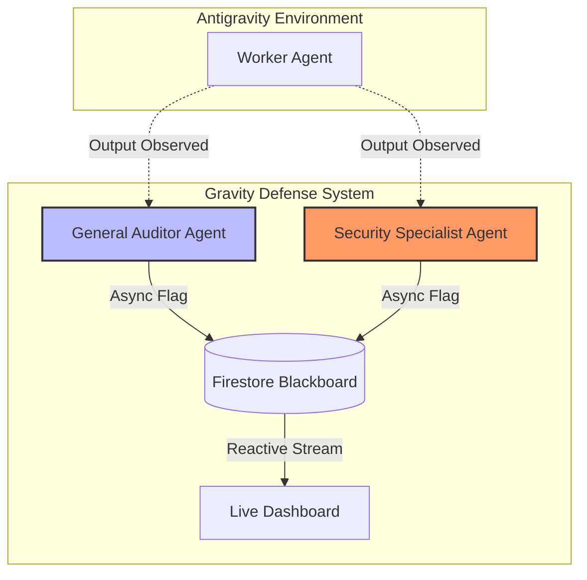

# 🌍 Gravity

**Keeps your AI sessions grounded so you stay productive and sane.**

Gravity is an intelligent, iterative multi-agent system built with Gemini and Google Cloud. It runs as a parallel monitoring agent inside Antigravity, watching for drift, stalls, scope creep, and terminal errors — then flags them in real time.

## 🎯 What It Does

- **Live Flags**: Non-intrusive toasts when the AI drifts, stalls, or expands scope
- **Double-Check Before Accept**: GO / NO-GO verdicts on proposed changes with 1-sentence reasons
- **Terminal Monitoring**: Catches errors, stalled commands, and unexpected output
- **Quick Authority Voice**: Short, direct statements — no fluff
- **Iterative Learning**: Flags and decisions stored in Firebase, gets smarter over sessions

## 🏗️ Multi-Agent Architecture

Gravity employs a **Sovereign Dual-Agent** defense model to ensure zero-trust grounding.



### 🤖 The Agents
1. **General Auditor (`gravity-watch.js`)**: Monitors for rule violations, drift, and state grounding. Enforces Rules #1-#13.
2. **Security Specialist (`gravity-security.js`)**: A ruthlessly specialized agent focused exclusively on **Rule #4 (Security/Keys)** and **Rule #14 (Directory Fidelity)**. Runs as an independent process for fail-safe redundancy.

## 🚀 Quick Start

```bash
# Install dependencies
npm install

# Copy and configure environment
cp .env.example .env
# Edit .env with your Firebase + Gemini credentials

# Start Gravity
npm run dev
```

Then open `http://localhost:3456` in your browser.

## 🔧 Tech Stack

- **Gemini 2.5 Flash** — AI analysis engine (via Google AI API)
- **Firebase / Firestore** — Rules storage + flag/decision history
- **Express** — Local API server
- **Antigravity Agent Manager** — Multi-agent orchestration

## 📁 Project Structure

```
gravity/
├── GRAVITY_RULES.md              # Rules the monitor enforces
├── GRAVITY_AGENT_INSTRUCTIONS.md # Instructions for the Gravity agent
├── WORKER_AGENT_INSTRUCTIONS.md  # Instructions for the Worker agent
├── AGENT_MANAGER_SETUP.md        # How to set up both agents
├── server.js                     # Express API server
├── src/
│   ├── firebase.js               # Firebase Admin SDK init
│   ├── gemini.js                 # Gemini API integration
│   ├── rules.js                  # Rules loading & sync
│   └── history.js                # Flag/decision logging
└── public/
    ├── index.html                # Dashboard UI
    ├── styles.css                # Dashboard styles
    └── app.js                    # Dashboard client logic
```

## 🏆 Hackathon Submission

Built for UConn GDG Build with AI 2026. Uses:
- ✅ Google AI (Gemini) — core AI technology
- ✅ Firebase (Firestore) — backend + database
- ✅ Antigravity Agent Manager — multi-agent system
- ✅ Iterative user interaction — flags + double-check feedback loop

**Theme fit**: Intelligent, iterative multi-agent system that evolves through user interaction.
